# Pose Estimation and Optical Flow
**Computer Vision Meets Machine Learning, Fall 2017**

Mohammad Afshar, ma2510@nyu.edu

[Radhika Mattoo](https://github.com/radhikamattoo), rm3485@nyu.edu

## Overview

This project uses Keras' model.h5 model to perform pose estimation on a series of images we created.

We then used the first frame of a video we created from the series of images to extract key points on the skeleton, and used these points as input into Lucas-Kanade optical flow to see if the program would be able to track the skeleton during the video.

The rest of this README details our process/results, as well as details on how to run and build our program.

## Results

1. Pose Estimation

    The thing we performed was pose estimation on a series of images we took of Mohammad, where he slowly moved across the screen. Below are a before and after images for 1 frame.

    Original Image:

    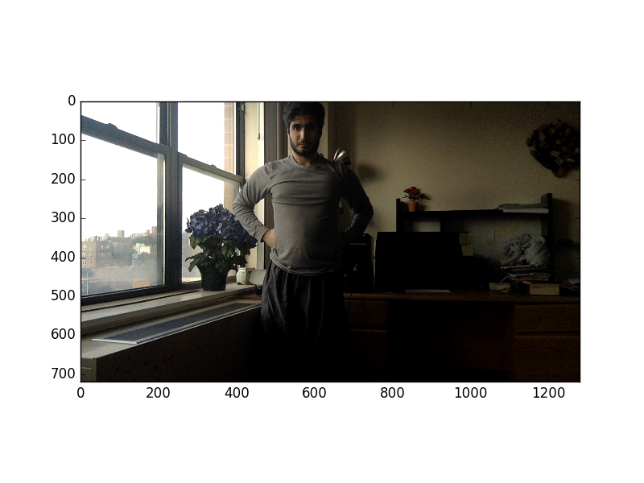

    Pose Estimation Results:

    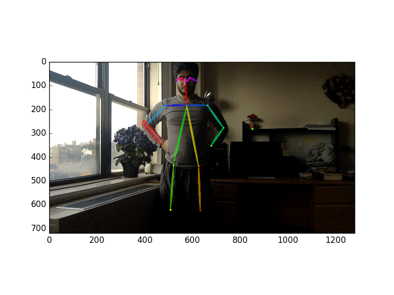

    The results from the Keras model are quite good, despite the drastic change in lighting, and the fact that the person is not visible below the knees.

2. Optical Flow

    We decided to use the Lucas-Kanade algorithm offered by OpenCV to perform optical flow. We wanted to run the algorithm on the **original** images, to see if it would be able to track the skeleton.

    However, how would the algorithm know to track the skeleton points on the original image? The built-in OpenCV function `goodFeaturesToTrack` chooses arbitrary points, but we wanted the algorithm to specifically track points on the skeleton found by the Keras model. Thus, we had to manually extract the skeleton points on the original image by comparing the points to the corresponding skeleton image.

    Once we had extracted the skeleton points on the first original image, we then fed them into the Optical Flow algorithm.

    Unfortunately, our images had too much variance in position, so the optical flow algorithm couldn't track the points correctly. Below is a sample of our results:

    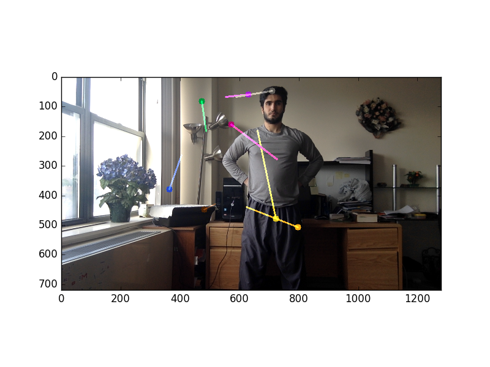

    As you can see, the algorithm wasn't able to track the points correctly - the lines should look (nearly) linear, as Mohammad is simply moving across the screen.

3. Pose Estimation (Again...)

    When we asked Professor Geiger about these results, he informed us about our mistake in using images. The difference in the tracking points were too large, and so we had to give the algorithm a **video** instead of a set of images.

    We then took a video of Mohammad simply moving across the screen. Instead of performing pose estimation on the hundreds of frames in the video, we decided to extract the first frame of the video, perform pose estimation on it, and manually extract the tracking points to feed into optical flow.

    Original First Frame:

    

    Pose Estimation Results:

    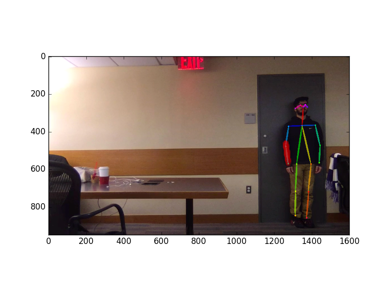

4. Optical Flow (Again...)

    Now that we had a video instead of images, we extracted the skeleton data points from the above pose estimation results, and passed them into the Lucas-Kanade optical flow algorithm.

    We performed optical flow on 3 different sets of points:

    1. Left Eye, Right Eye, Left Shoulder, Right Shoulder, Center Chest
    2. All of the above, along with the Left Hip and Right Hip
    3. All of the above, along with the Left Elbow and Right Elbow

    Set 1 Results:

    

    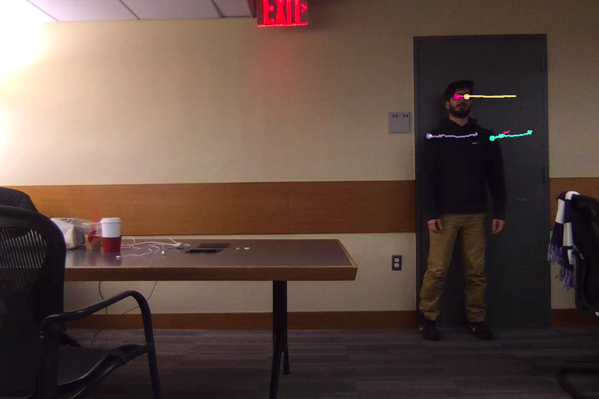

    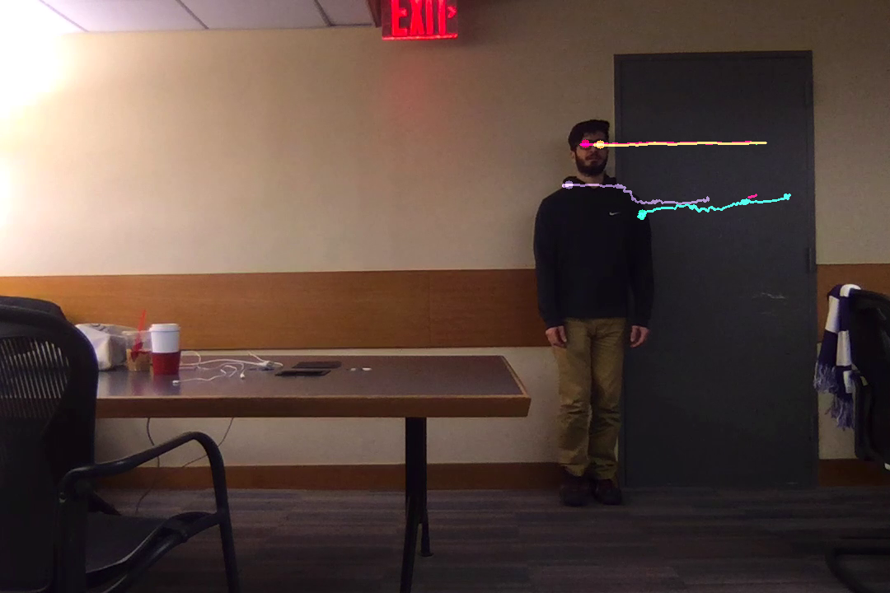

    

    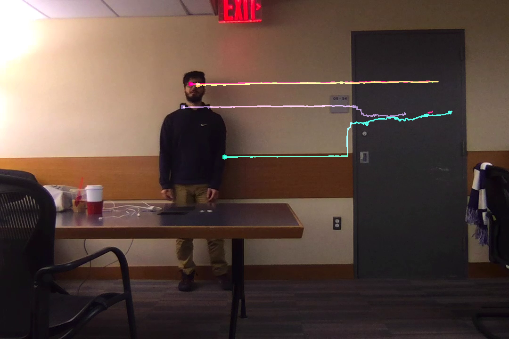

    As you can see, the optical flow algorithm works very well, except for the right shoulder's optical flow line drops to the elbow. We assumed that, because Mohammad moved past the grey door, the sudden shift in background color caused this optical flow line to change.

    Set 2 Results:

    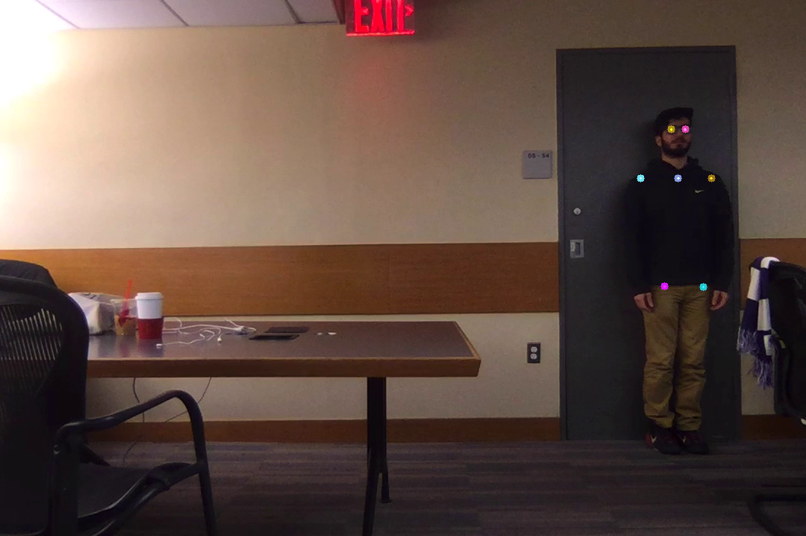

    

    

    

    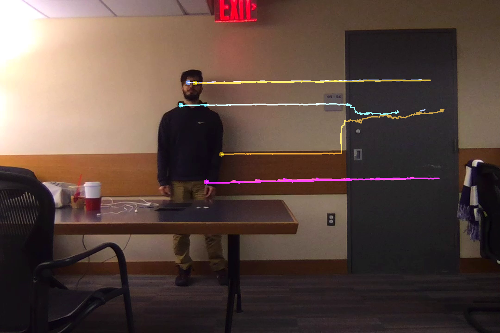

    The algorithm works relatively well for the hips, until Mohammad starts moving a lot past the grey door. When this occurs, the left hip optical flow line begins to collide with the right hip's. We assume this is because when Mohammad is moving across the screen, his hips are moving the most, causing a large difference in position that the optical flow algorithm struggles to recognize.

    Set 3 Results:

    

    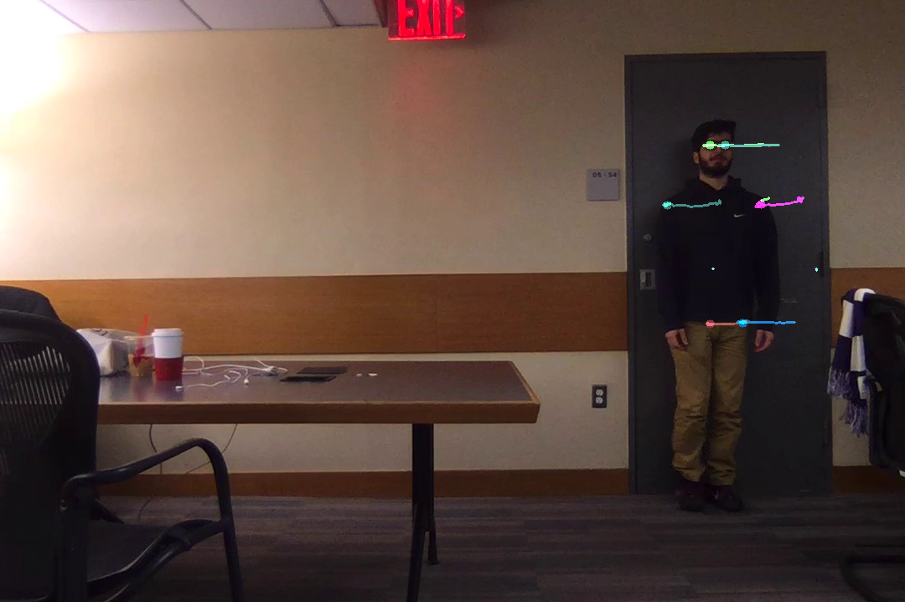

    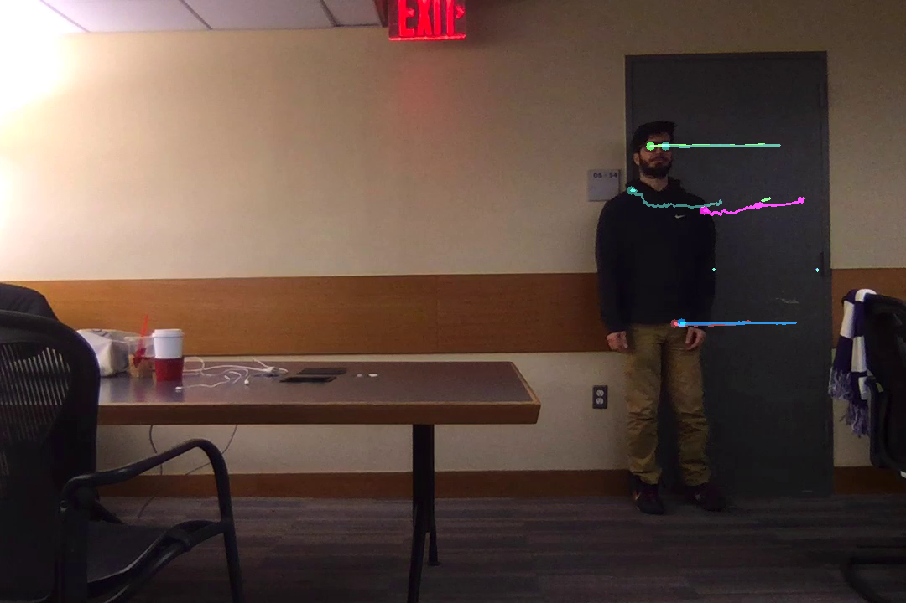

    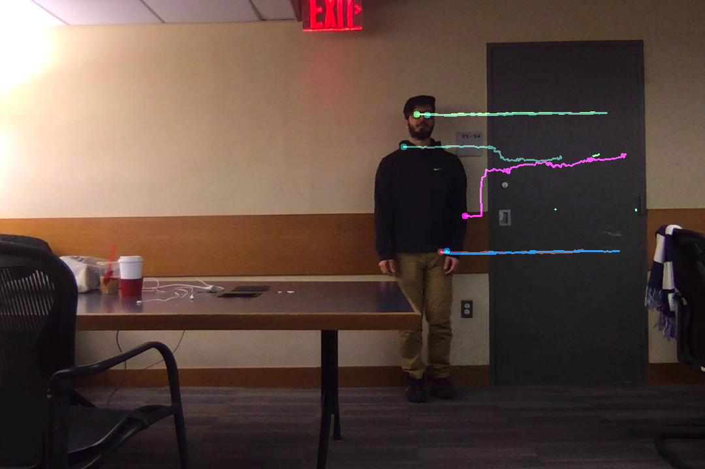

    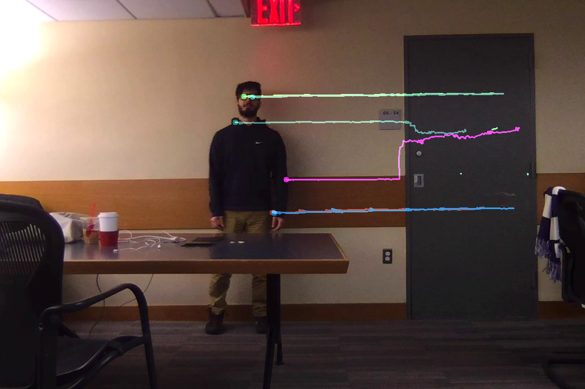

    The algorithm did not work for the elbows. As you can see, as Mohammad moves across the screen, the elbow 'points' are completely static, meaning the algorithm wasn't able to track these points. We believe this is because Mohammad is wearing a large black sweatshirt, which makes it more difficult for the algorithm to recognize when there's been a change in position.

## Running
